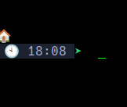

# AliasHub

AliasHub is a comprehensive alias management system for Bash, designed to enhance your command-line productivity and streamline your workflow. 

## Table of Contents
- [Features](#features)
- [Installation](#installation)
- [Usage](#usage)
- [Configuration](#configuration)
- [Customization](#customization)
- [Contributing](#contributing)
- [License](#license)

## Features

- Centralized management of Bash aliases
- Pre-configured aliases for common tasks
- Easy-to-use command-line shortcuts
- Customizable prompt configurations via starship
- Organized structure for different types of aliases (e.g., git, navigation, package management)
- Flexible and extensible design

**Changes**
I've made some drastic changes to the prompt configuration because the original method sucked.
After discovering [starship](https://starship.rs/). Starship offers way better configurations for the
commandline than my feeble attempt at it. It is truned off by default because if you want to use it you have to choses to install it. 

To install via curl: curl -sS https://starship.rs/install.sh | sh

or [Hombrew(https://brew.sh/)]: brew install starship

After installing starship navigate to ~/.alias/.propmts and uncomment eval "$(starship init bash)"
Then navigate to ~/.alias/.starship_config and uncomment the only commented line there. Save both files and open a terminal you should see somthing like this 

When I figure out how to automate this entire process I will push an update.

## Installation

1. Clone the AliasHub repository:
git clone https://github.com/yourusername/AliasHub.git ~/.aliashub

2. Navigate to the AliasHub directory:
cd aliashub

3. Run the installation script:
chmod +x install.sh && ./install.sh

or 

bash install.sh

This script will automatically add the necessary line to your `~/.bashrc` file to set up AliasHub.

4. Reload your Bash configuration or restart your terminal:
source ~/.bashrc

## Usage

After installation, you can start using the pre-configured aliases immediately. Here are some examples:

- `pyrun`: Run a Python script
- `clone`: Clone a git repository
- `edalias`: Edit your bash aliases
- `upgrade`: Update and upgrade system packages

For a full list of available aliases, use the command:
alias

## Configuration

AliasHub's configuration files are located in the `~/.aliashub` directory. Key files include:

- `.bash_aliases`: Main alias definitions
- `.bash_functions`: Custom Bash functions
- `.cl`: Command-line shortcuts
- `.package`: Package management aliases
- `.prompts`: Prompt configurations

## Customization

To add your own aliases or modify existing ones:

1. Edit the appropriate configuration file (e.g., `~/.aliashub/.bash_aliases`)
2. Add your new alias or modify an existing one
3. Save the file and run `refresh` to reload your Bash configuration

## Contributing

Contributions to AliasHub are welcome! Please feel free to submit a Pull Request.

## License

This project is licensed under the MIT License - see the [LICENSE](LICENSE) file for details.